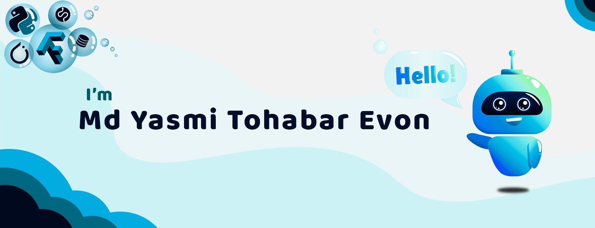

<!-- MYTE GitHub Poster -->

    

<!-- Social Links design -->

    
    
    

<!-- Title  -->
<h3 align = "center"><b>Machine Learning Enthusiast</h3>

<!-- About Me  -->
I’m a **Machine Learning Enthusiast** and Full Stack Developer who is passionate about exploring data, 
implementing models and performing mathematical and statistical analysis. I completed my B.Sc. in 
**Software Engineering** from Shahjalal University of Science and Technology. I enjoy reading fiction books and travelling.

* ⚙️ Currently, working on `Deep Learning` and `TensorFlow`
* 📒 Practicing `Data Structure` and `Algorithms`
* ✨ Interested in **Machine Learning** related `Technical Writing and Research` 

<!-- Technologies -->
### 🛠️ My Technologies
|            **Languages**             |                                                                 |
|:------------------------------------:|:-----------------------------------------------------------------------------------------------------------------------------------------------------------------------------------------------------------------------------------------------------------------------------------------------------------------------------------------------------------------------------------------------------------------------------------------------------------------------------------------------------------------------------------------------------------------------------------------------------------------------------------------------------------------------------------------------------------------------------------------------------------------------------------------------------------------------------------------------------------------------------------------------------------------------------------:|
|            **Databases**             |                                                                                                                                                                                                                                                                                                                                                                                                                                                                                                                                                                                                    |
| **Machine Learning / Deep Learning** |           |
| **Framework, Platforms & Libraries** |                                    |
|              **Others**              |                                                                                                                                                                                                                                                                                                                                                                                                                                                                                               |

<!-- Top 3 Selected Projects -->
### ♨️ Top 3 Projects
|                                                            Project                                                             |                              **Name**                              | Description                                                           | Technologies |
|:------------------------------------------------------------------------------------------------------------------------------:|:------------------------------------------------------------------:|-----------------------------------------------------------------------|--------------|
|  | <a href="https://github.com/MYTE21/COVID.Death"><b>COVID.Death</a> | Exploring and analysing the global data on confirmed COVID-19 deaths. | python       |
|    |   <a href="https://github.com/MYTE21/DS.JobSal"><b>DS.JobSal</a>   | Salaries of jobs in the Data Science domain.                          | python       |
|        |       <a href="https://github.com/MYTE21/BAS.R"><b>BAS.R</a>       | Bengali Automatic Speech Recognition                                  | python       |
<!-- Link to all the repo -->

    <a href = "https://github.com/MYTE21?tab=repositories&type=source" target="_blank">
        🔗 <b>All Project Link </b>
    </a> 

<!-- GitHub Statistics -->
### 🏷️ GitHub Statistics 

