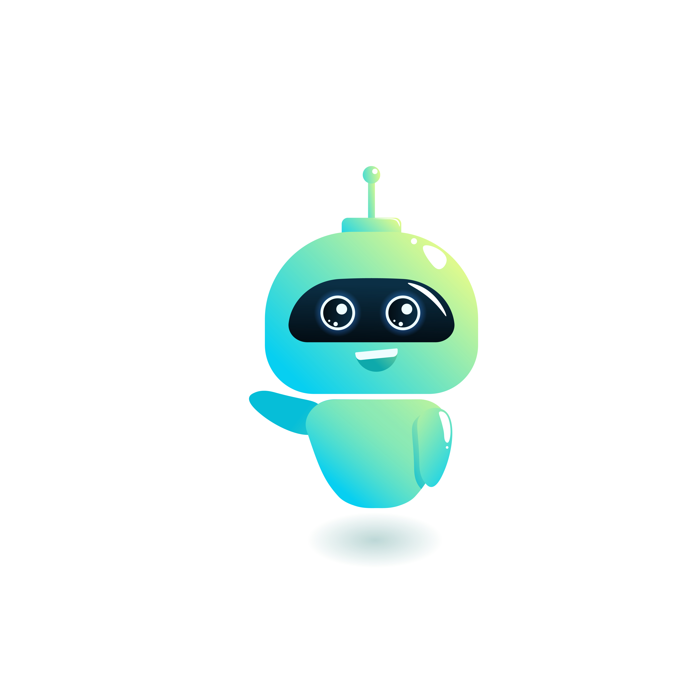

<!-- MYTE GitHub Poster -->

    

<!-- Social Links design -->

    
    
    

<!-- Title  -->
<h3 align = "center"><b>Machine Learning Enthusiast</h3>

<!-- About Me  -->
I’m a **Machine Learning Enthusiast** and Full Stack Developer who is passionate about exploring data, 
implementing models and performing mathematical and statistical analysis. I completed my B.Sc. in 
**Software Engineering** from Shahjalal University of Science and Technology. I enjoy reading fiction books and travelling.

* ⚙️ Currently, working on `Deep Learning` and `TensorFlow`
* 📒 Practicing `Data Structure` and `Algorithms`
* ✨ Interested in **Machine Learning** related `Technical Writing and Research` 

<!-- Technologies -->
### My Technologies 🛠️
<!-- Languages -->
| **Languages** |          |
|---------------|------------------------------------------------------------------------------------------------------------------------------------------------------------------------------------------------------------------------------------------------------------------------------------------------------------------------------------------------------------------------------------------------------------------------------------------------------------------------------------------------------------------------------------------------------------------------------------------------------------------------------------------------------------------------------------------------------------------------------------------------------------------------------------------------------------------------------------------------------------------------------|

<!-- Databases -->
| **Databases** |    |
|:-------------:|-------------------------------------------------------------------------------------------------------------------------------------------------------------------------------------------------------------------------------------------------------------------------------------------------------------------------------------|

<!-- ML / DL -->

<!-- Framework, Platforms & Libraries -->

<!-- Top 3 Selected Projects -->
<!-- FIRST PROJECT:  -->
|  | Hello test Hello test Hello test Hello test Hello test Hello test Hello test  Hello test Hello test Hello test Hello test Hello test Hello test Hello test Hello test Hello test Hello test Hello test Hello test Hello test Hello test Hello test Hello test Hello test Hello test Hello test Hello test Hello test Hello test Hello test Hello test Hello test Hello test Hello test Hello test Hello test |
|-----------------------------------------------------------|------------------------------------------------------------------------------------------------------------------------------------------------------------------------------------------------------------------------------------------------------------------------------------------------------------------------------------------------------------------------------------------------------------------|
| <b>PROJECT NAME                                           | USED TECHNOLOGIES -                                                                                                                                                                                                                                                                                            |

<!-- SECOND PROJECT:  -->
|  | Hello test Hello test Hello test Hello test Hello test Hello test Hello test  Hello test Hello test Hello test Hello test Hello test Hello test Hello test Hello test Hello test Hello test Hello test Hello test Hello test Hello test Hello test Hello test Hello test Hello test Hello test Hello test Hello test Hello test Hello test Hello test Hello test Hello test Hello test Hello test Hello test |
|-----------------------------------------------------------|------------------------------------------------------------------------------------------------------------------------------------------------------------------------------------------------------------------------------------------------------------------------------------------------------------------------------------------------------------------------------------------------------------------|
| <b>PROJECT NAME                                           | USED TECHNOLOGIES -                                                                                                                                                                                                                                                                                            |

<!-- THIRD PROJECT:  -->
|  | Hello test Hello test Hello test Hello test Hello test Hello test Hello test  Hello test Hello test Hello test Hello test Hello test Hello test Hello test Hello test Hello test Hello test Hello test Hello test Hello test Hello test Hello test Hello test Hello test Hello test Hello test Hello test Hello test Hello test Hello test Hello test Hello test Hello test Hello test Hello test Hello test |
|-----------------------------------------------------------|------------------------------------------------------------------------------------------------------------------------------------------------------------------------------------------------------------------------------------------------------------------------------------------------------------------------------------------------------------------------------------------------------------------|
| <b>PROJECT NAME                                           | USED TECHNOLOGIES -                                                                                                                                                                                                                                                                                            |